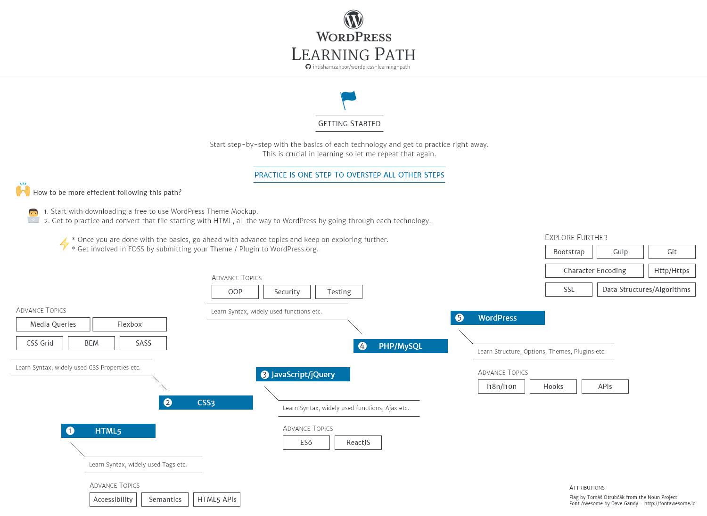

## Disclaimer
> The learning path is a self-reminder for me to stay on track in my WordPress Development journey as i still have a long way to go. When i first started out, i had my fair share of confusion with plethora of tools available online in web development, which wasted a lot of my time. My goal is to save you from wasting yours. This learning path is a guide i came up with after learning from my own mistakes and asking a lot of experienced WordPress Developers about their opinion. The WordPress Development Toolset has not changed drastically over the years, so rest assured you will be using these tools and technologies in a long haul. Now all there is left for me to say Good Luck and Happy Coding!!!

## A Learning Path for Newbies in WordPress Development

## Wrap Up

If you think any of the learning path can be improved, please do open a PR with improvements and submit any issues. I will continue to improve this, so you might want to watch/star this repository to revisit.

## TODO

- [] Add more resources for the technologies involved

## Contribution

The learning path is made using [Adobe Xd]https://www.adobe.com/products/indesign/free-trial-download.html). The main file can be located at `/project` directory. For modification of the learning path, open Adobe Xd, click **Hamburger Menu > Open**, this will open the learning path file for you, improve it as you please, upload and don't forget to update the image in readme and then create a PR.

- Please open pull request with improvements
- Feel free to discuss matter or new ideas in issues
- Sharing is caring
- Come say hi or drop by with any feedback => 

## License

